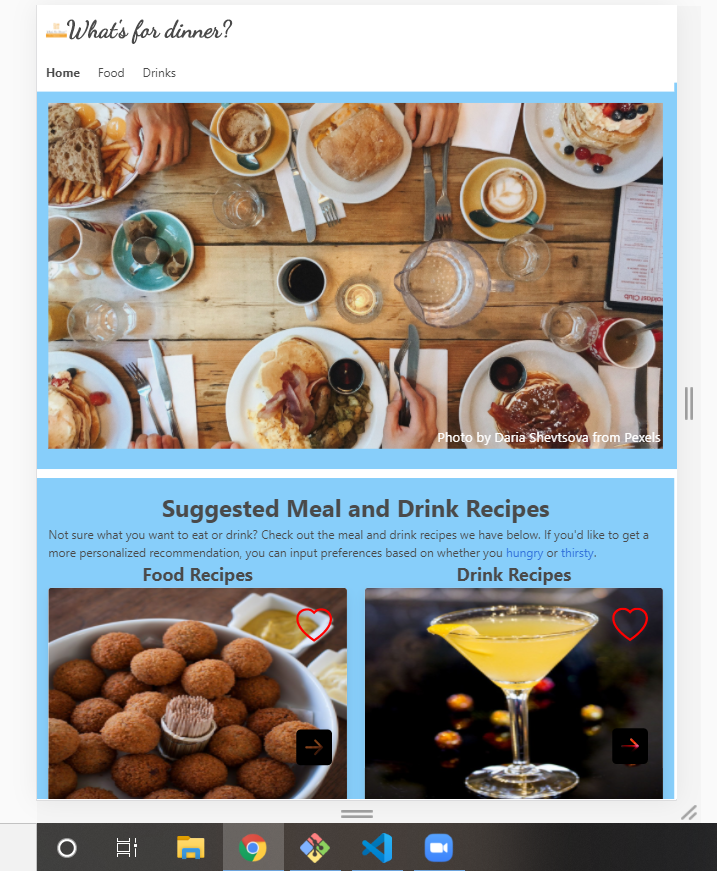

# What's for dinner?

This project is completed as part of a requirement for a coding boot camp.  The deployed webpage is available [here](file:///C:/Users/jalbe/Desktop/classActivities/project-1/index.html).

In this project, we will create a website meant to provide food and drink recommendations.  If the user is indecisive about what they want, this will provide them with an answer as to what they should have.  Furthermore, the recipe for making the suggested item will also be given to the user.  Note that the food and drink recommendations don't come as pairings, but rather as different options for the user to have.

If the user decides that they have some idea of what they want to eat or drink, we allow the user to restrict the recommendation possiblities by inputting their preferences.  Based on these preferences, we provide a new recommendation.

Some features of the website,
i) On the main page you are greated by a hunger inducing picture.
ii) On top of the page is a navbar with the name and links to the three pages included in the website.
iii) Below this picture, you are able see a random meal and random drink selections.
iv) You are able to save these suggestions to either your favorite food or favorite drink list by clicking the favorite icon.  Hitting this icon again will remove the item from your favorites.
v) Your favorite list can be retrieved, when a item is clicked it will appear on the page.
vi) You can also remove items from your favorites when viewin them in the modal by pressing the associated remove button.
vii) When you click on the food or drink card, it will display the recipe with instructions to make it.
viii) On the food page, you can search for items by name, ingredients or dish origin.
ix) On the food page, you can also choose a food category and have all dishes within that category displayed.
x) On the drink page, you can search for drinks by name or ingredient.
xi) If you don't want to search something specific, you can also hit the next button on the food or drink card to get a new random suggestion.

